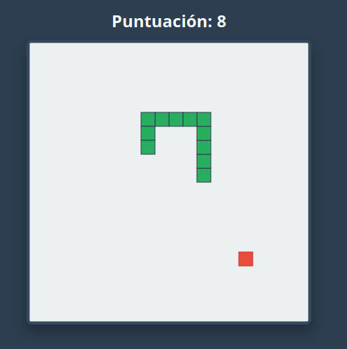

# 🐍 Snake Online Multijugador

Un clon moderno y responsivo del clásico juego de la serpiente, desarrollado con Vanilla JavaScript y conectado a una base de datos en tiempo real para mantener un ranking global de puntuaciones. Hecho con Gemini Pro 3.1 como proyecto de experimentación. 

🕹️ **[Juega la versión en vivo aquí](https://alexysge.github.io/SnkOnline/)**

## ✨ Características Principales

* **Ranking Global en Tiempo Real:** Integración con Firebase Firestore para guardar y mostrar el Top 10 de jugadores a nivel mundial.
* **Diseño Responsivo (Mobile-First):** Interfaz fluida que se adapta a cualquier tamaño de pantalla.
* **Soporte Multiplataforma:** * 💻 **PC:** Soporte para controles clásicos (Flechas direccionales y WASD).
  * 📱 **Móvil:** Controles táctiles integrados (Swipe/Deslizamiento) y un D-Pad en pantalla para mayor precisión.
* **Prevención de Errores (QA):** Lógica implementada para evitar el "doble input" (movimientos suicidas) y manejo de umbrales en pantallas táctiles para ignorar toques accidentales.

## 🛠️ Tecnologías Utilizadas

* **IA:** Gemini Pro 3.1
* **Frontend:** HTML5, CSS3, JavaScript (Vanilla, ES6 Modules).
* **Backend / BaaS:** Firebase (Cloud Firestore) con reglas de seguridad estrictas para evitar inyección de datos falsos.
* **Despliegue:** GitHub Pages.

## 🚀 Instalación y Uso Local

Si deseas correr este proyecto en tu entorno local para hacer pruebas o modificaciones:

1. Clona este repositorio:
   ```bash
   git clone https://github.com/alexysge/SnkOnline.git


2. Abre la carpeta del proyecto.

3. Debido a las políticas de seguridad (CORS) con los módulos de ES6 y Firebase, necesitas levantar un servidor local. Puedes usar extensiones como Live Server en VS Code.

4. Abre index.html en tu navegador a través del servidor local.

## 📸 Capturas de Pantalla

**Vista en Computadora:**





**Vista en Celular (con controles táctiles):**


